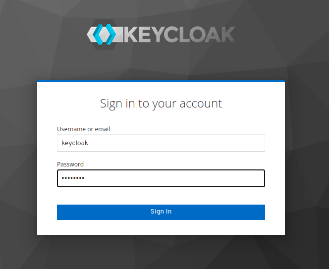

# keycloak-in-docker

[](https://keepgrowing.in/)

## About this project

This simple project shows an example Docker configuration for Keycloak.

To learn how to set up a project like this one, check out the following articles:

* [Keycloak in Docker #1 – How to run Keycloak in a Docker container](https://keepgrowing.in/tools/keycloak-in-docker-1-how-to-run-keycloak-in-a-docker-container/)
* [Keycloak in Docker #2 – How to import a Keycloak realm](https://keepgrowing.in/tools/keycloak-in-docker-2-how-to-import-a-keycloak-realm/)

## Getting started

First, [clone](https://docs.github.com/en/github/creating-cloning-and-archiving-repositories/cloning-a-repository-from-github/cloning-a-repository)
this repository.

Then, start the `keycloak` and `keycloakdb` containers with the following command:

```shell
docker-compose -f docker-compose-keycloak.yml up -d
```

Make sure that the `keycloak` container is up. For instance, you can run the `docker ps` command in your terminal:


The `keycloak` service has a default realm imported from the
[keycloak/realms/realm-export.json](keycloak/realms/realm-export.json) file that specifies all the default users.
 Information about the import can be found in the container logs when the service is started for the first time:  


### Credentials

Below you'll find a list of default user accounts.

#### Keycloak admin

* username: `keycloak`
* password: `keycloak`

#### Default users

* usernames: `christina`, `hanna`, `carlo`, `noel`
* password: `test`
* realm role: `user`

### Visit Keycloak

* Visit the [http://localhost:8024/auth](http://localhost:8024/auth) url:


* Select the `Administration Console` option and log in as the Keycloak admin [`keycloak:keycloak`]:



* As an admin you can see a list of users associated with the `Example-Realm` realm by clicking the `View all users` button on the
  [http://localhost:8024/auth/admin/master/console/#/realms/Example-Realm/users](http://localhost:8024/auth/admin/master/console/#/realms/Example-Realm/users) page.
* What's more, you can log in as any user associated with the `Example-Realm` realm by clicking the `Sign in` button on the
  [http://localhost:8024/auth/realms/Example-Realm/account](http://localhost:8024/auth/realms/Example-Realm/account) page.
* The realm roles are available under the [http://localhost:8024/auth/admin/master/console/#/realms/Example-Realm/roles](http://localhost:8024/auth/admin/master/console/#/realms/Example-Realm/roles) url.

## Features

* Dockerized Keycloak server and its PostgreSQL database
* Default Example-Realm is imported when the `keycloak` container starts

## Built With

* [Keycloak](https://www.keycloak.org/)
* [Docker Compose](https://docs.docker.com/compose/)
